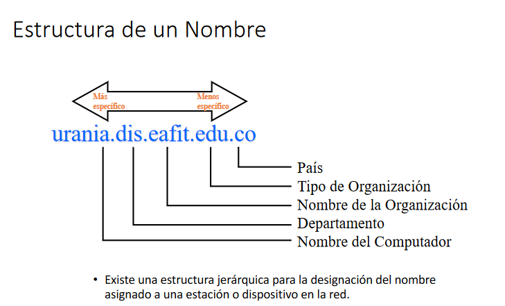

# DNS

Estoy haciendo esto porque la motivación para estudiar va a necesitar de distracciones extras, a parte me puedo sentir orgulloso de andar mixing and matching cosas que clarametne no se deberían poner así.

Voy a ver si en esto al menos gano un poco de entendimiento en lo que tengo que estudiar o en cosas que de por sí ya tenía que hacer.

Empezemos con DNS.

Existe porque nadie va a recordar que  142.250.188.14 es como se llega al nombre de dominio google.com y resolver este problema para toda persona que quiera un dominio va a ser un infierno. **Tiene** que ser jerárquico, distribuido y controlado.

## Objetivos

Convertir una dirección IP, en una o varias direcciones canónicas.

